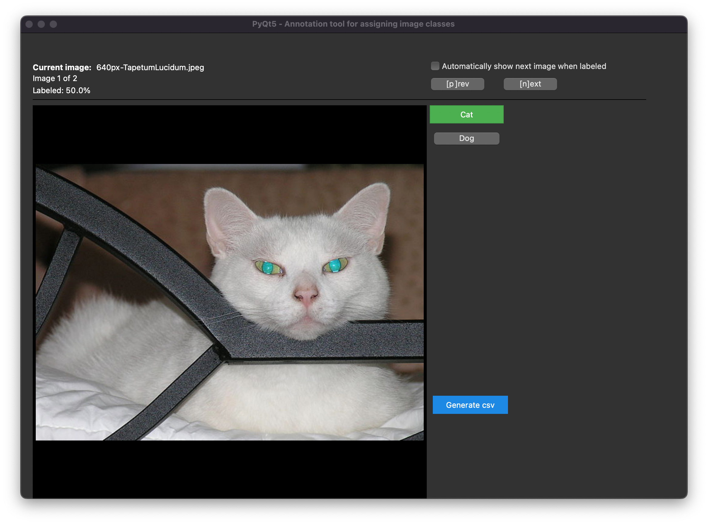

# PyQt Image Annotation Tool

A simple image annotation tool based on Python and PyQt.

This script is a fork of https://github.com/robertbrada/PyQt-image-annotation-tool



## Features

- Cross-platform support
- Multilabel annotation
- Supports png, jpg, jpeg, and dcm (DICOM) image formats
- Built-in zoom feature
- Hotkeys
- CSV generation

## Installation and usage

1. Clone the project:
    ```bash
    git clone https://github.com/robertbrada/PyQt-image-annotation-tool.git
    ```

2. Enter the directory and install the dependencies (you might need to use ```pip3``` instead of ```pip```):
    ```bash
    cd PyQt-image-annotation-tool
    pip install -r requirements.txt
    ```
    Some DICOM files might require GDCM and pylibjpeg.
    For installing see: https://pydicom.github.io/pydicom/stable/tutorials/installation.html#install-the-optional-libraries

3. Run the app (use ```python3``` for Python 3)
   ```bash
    python main.py
    ```

## Keyboard shortcuts

- N: Next image
- P: Previous image
- 1-9: Select label
- Ctrl and -: Zoom out
- Ctrl and +: Zoom in
- Ctrl and mouse wheel: Zoom in/out

